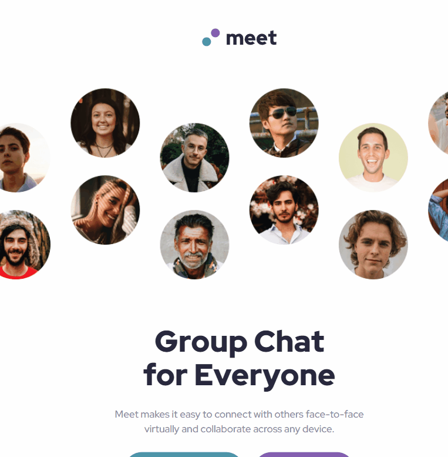
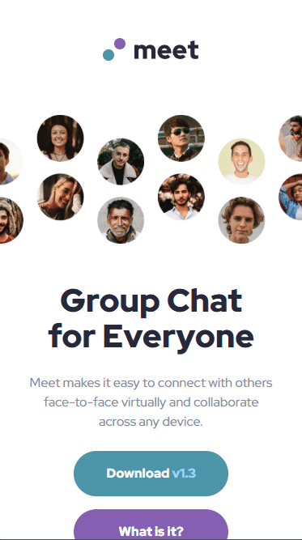

# Meet Landing Page (Mobile-First) | Frontend Mentor

## 📌 Overview

This project is a solution to the Meet Landing Page challenge from Frontend Mentor. The goal was to build a fully responsive testimonials layout using modern CSS techniques such as Grid and Flexbox, following a mobile-first approach to ensure optimal user experience across different screen sizes.

## 🎯 Project goal

The goal of this project was to practice building a fully responsive landing page based on a Figma design, focusing on layout structuring, responsive images, and mobile-first development.

It also aimed to improve my ability to translate design decisions into clean and maintainable code.

## 📚 Table of Contents

- [Overview](#overview)
- [Project goal](#project-goal)
- [Preview](#preview)
- [Links](#links)
- [Built with](#built-with)
- [Features](#features)
- [Development process](#development-process)
- [Technical decisions](#technical-decisions)
- [Challenges](#challenges)
- [How to run the project](#how-to-run-the-project)
- [What I learned](#what-i-learned)
- [Future Improvements](#future-improvements)
- [AI Collaboration](#ai-collaboration)
- [Author](#author)

---

## 🖼️ Preview

### 🖥️ Desktop

### 📱 Tablet

### 📱 Mobile

---

## 🌐 Links

- [🔗 Repository](https://github.com/israel-monteiro/meet-landing-page.git)
- [🚀 Live Site](https://israel-monteiro.github.io/meet-landing-page/)
- [📌 Challenge](https://www.frontendmentor.io/solutions/meet-landing-page-with-grid-and-flexbox-oPENVuhgpx)

---

## ⚙️ Built with

- Semantic HTML5
- CSS3 (Custom Properties)
- CSS Grid
- Flexbox
- Mobile-First Workflow

---

## ✨ Features

- Fully responsive layout across mobile, tablet, and desktop devices
- Mobile-first development approach
- Structured layout using CSS Grid for complex positioning
- Flexible components built with Flexbox
- Consistent spacing and alignment following design specifications

---
## 🧩 Development process

I started by structuring the HTML with a focus on the mobile and tablet layouts, ensuring a solid base before styling.

Then, I implemented the mobile-first CSS, building the layout step by step. After that, I worked on the tablet responsiveness using media queries.

Once the base layouts were complete, I returned to the HTML to add the two additional images required for the desktop version. This required updating the CSS to hide and display specific images depending on the screen size.

During the desktop implementation, I adjusted the layout and image positioning to match the design. I also needed to refactor part of the footer structure by introducing a new container to correctly apply a full-width background image, since the original structure had width limitations and multiple elements that could not share the same background.

Finally, I refined class names, improved CSS organization, and completed the responsive adjustments to finalize the project.

## ⚙️ Technical decisions

I used a combination of CSS Grid and Flexbox to structure the layout efficiently. CSS Grid was applied for the overall page layout due to its ability to manage complex positioning, while Flexbox was used for aligning and distributing elements within components.

A mobile-first approach was chosen to simplify the initial implementation and ensure a solid responsive foundation, especially since the mobile layout required fewer grid adjustments. This also helped manage the more complex image behavior introduced at larger breakpoints.

CSS custom properties (variables) were implemented to improve maintainability, ensuring consistency in spacing, colors, and typography across the project.

## ⚠️ Challenges

One of the main challenges in this project was handling responsive images across different breakpoints. The layout required three distinct images: two visible only on desktop and one for mobile/tablet. Deciding the best HTML structure for this behavior took time and experimentation.

Another challenge was positioning images so they partially overflowed the viewport on mobile, replicating the design's visual effect without using absolute positioning.

Additionally, I faced difficulties achieving pixel-perfect accuracy with background images compared to the Figma design. This led me to understand the importance of balancing visual fidelity with practical implementation in real-world projects.

## 🚀 How to run the project

Clone the repository:

    git clone https://github.com/israel-monteiro/meet-landing-page.git

Navigate to the project folder:

    cd meet-landing-page

Open the `index.html` file in your browser.

---

## 📚 What I learned

- How to effectively structure responsive layouts using a mobile-first approach
- Practical use of CSS Grid for complex layouts and Flexbox for internal alignment
- Strategies for handling responsive images across multiple breakpoints
- The importance of balancing design fidelity with practical implementation
- How to refactor and improve code organization during development

---

## 🚧 Future Improvements

- Improve semantic HTML to enhance accessibility and structure
- Refine naming conventions for variables and classes
- Refactor and simplify CSS for better readability and scalability

---

## 🧠 AI Collaboration

During the development of this project, AI tools such as ChatGPT were used to:

- Review and refactor code structure
- Identify potential issues and improvements
- Assist with GitHub setup and documentation

All suggestions were reviewed and adapted to fit the project's context.

---

## 👤 Author

- GitHub - [@israel-monteiro](https://github.com/israel-monteiro)
- Frontend Mentor - [@israel-monteiro](https://www.frontendmentor.io/profile/israel-monteiro)